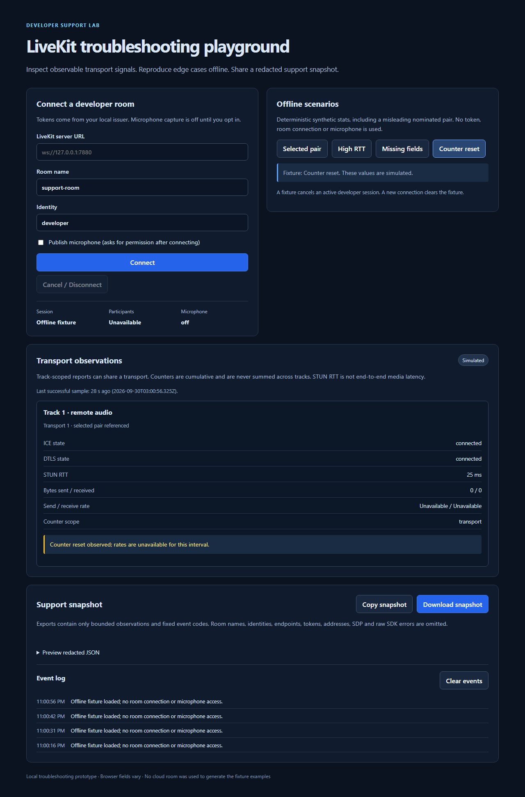

# LiveKit troubleshooting playground

A local developer-support lab for connecting a LiveKit room, inspecting browser transport observations, and exporting a bounded, redacted snapshot. Four deterministic offline scenarios let you inspect the UI without credentials, cloud rooms or a microphone.

This is a troubleshooting prototype. It does not diagnose root causes, measure end-to-end media quality, play subscribed media, or provide production authentication.



Synthetic offline counter-reset view. No cloud room or microphone was used.

## Run the offline demo

Use Node.js 24 and npm. From the repository root:

```sh
npm ci
npm --prefix client ci
npm --prefix server ci
npm --prefix server start
```

In another terminal:

```sh
npm --prefix client run dev
```

Open **http://127.0.0.1:5173**. Choose **Selected pair**, **High RTT**, **Missing fields** or **Counter reset**. Fixture mode is explicitly marked as simulated; it never requests a token, connects a room or accesses the microphone. Selecting a fixture cancels an active developer session.

The token server starts without credentials. A connection attempt then returns a clear “not configured” error. The client uses Vite's relative `/api` proxy, so use the documented URL. The production build can display fixtures independently; `vite preview` is a static preview and does not supply the token proxy.

## Optional developer-room connection

Copy `server/.env.example` to `server/.env`, enter credentials for **your own** developer LiveKit server, and restart the token process. Secrets stay in that process. Enter its `wss://` endpoint, a room and identity. Plain `ws://` is permitted only on loopback; endpoint credentials, queries and fragments are rejected.

The unauthenticated token issuer binds to **127.0.0.1** and accepts the configured browser origin. Origin checks are not authentication; do not expose this issuer as a production service. Tokens expire after five minutes, are scoped to the requested room, permit subscription, and disable data publishing. Media publishing is permitted only when **Publish microphone** is checked. The UI asks for microphone permission after connecting. Cancel, disconnect and unmount stop owned tracks, including capture that resolves after cancellation.

Room listeners are installed before connecting. Pending token requests are abortable and time out after 10 seconds. Generation checks discard stale connections, events and stats. Stats reads are scheduled five seconds **after** the previous read completes, preventing overlapping polls. A failed read retains the previous successful sample; samples older than 12 seconds are visibly stale.

## What the observations mean

The client calls the public track `getRTCStatsReport()` APIs for published local and subscribed remote tracks. It does not traverse private `Room.engine` internals. Track reports may expose the same shared transport; the UI keeps them separate and never sums their counters. A connection without published/subscribed media may have no accessible track stats. See the [LiveKit local-track API](https://docs.livekit.io/reference/client-sdk-js/classes/LocalVideoTrack.html) and [remote-track API](https://docs.livekit.io/reference/client-sdk-js/classes/RemoteTrack.html).

| Field | Interpretation |
| --- | --- |
| Selected pair | Resolved only from the transport's `selectedCandidatePairId` in the same report. A nominated or succeeded pair is not assumed to be selected. |
| STUN RTT | `currentRoundTripTime` converted from seconds to milliseconds. This is the latest STUN connectivity/consent RTT, not media latency. |
| ICE / DTLS | Browser-reported states when exposed. “Failed” identifies a reported state, not its cause. |
| Bytes | Cumulative transport counters, or the referenced pair's counters if transport counters are absent. Scopes are not mixed. Zero is a real value. |
| Rates | Counter differences × 8 divided by elapsed stats timestamps. The first sample, missing/repeated timestamps, changed pair scope and counter resets have unavailable rates. |

Browser fields are optional; absent, non-finite and invalid values are shown as **Unavailable**. The 300 ms RTT notice is an observation threshold, not a quality verdict. Zero traffic alone is not a failure. RTP packet loss, jitter, data-channel health and playback are not measured by this UI. Field semantics follow the [W3C WebRTC stats specification](https://www.w3.org/TR/webrtc-stats/).

## Sharing a snapshot

Copy and download produce the same versioned JSON schema, shown in the preview. The allowlist includes aliased track/transport labels, observations, sample time, session state and fixed event codes. It omits room names, participant identities, endpoint URLs, JWTs, IP addresses, SDP, certificates, raw reports and raw SDK errors. SDK logging is silenced; token-server logs contain fixed codes, never token prefixes.

Limits are **8 track reports**, **256 rows per report**, **8 transports per report**, **200 log entries** and **64 KiB UTF-8 per export**. Truncation is visible. Older logs are dropped if needed to meet the export bound. Timing, counts and topology still describe your session; inspect the preview before sharing.

## Validation

```sh
npm test
npm run lint
npm run build
```

The suite covers selected-pair ambiguity, zero/missing values, finite counters, reset-aware rates, report scoping, bounded redaction, token/connect/microphone cancellation, non-overlapping polling, malformed token payloads, and real loopback HTTP token issuance with locally signed fake-key JWT verification. No LiveKit server or cloud credentials are used.

Local evidence: Node 24.12.0 on Windows, 55 client tests and 17 server tests, strict TypeScript/Vite build, and ESLint/server syntax checks. CI is configured for Ubuntu and Windows with Node 24; remote results are recorded on the pull request. Real browser fixture/export checks are described in [the offline check record](docs/offline-checks.md). Live cloud behavior and cross-browser field availability have not been verified.

MIT license. Copyright (c) 2025 Maxence Jules.
